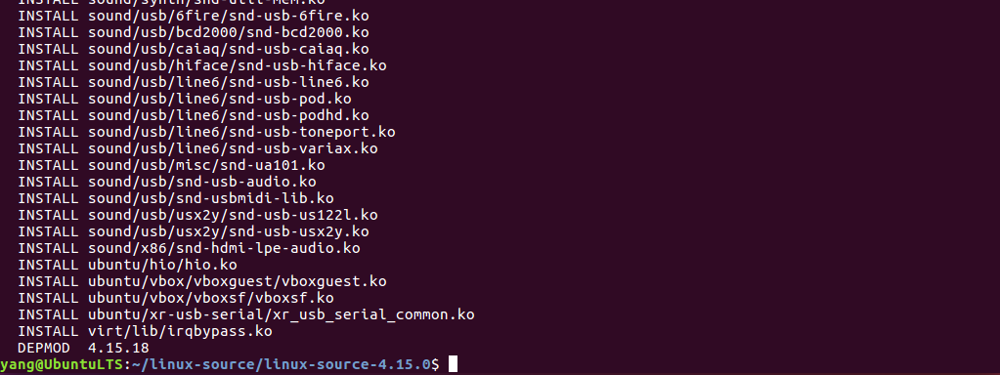
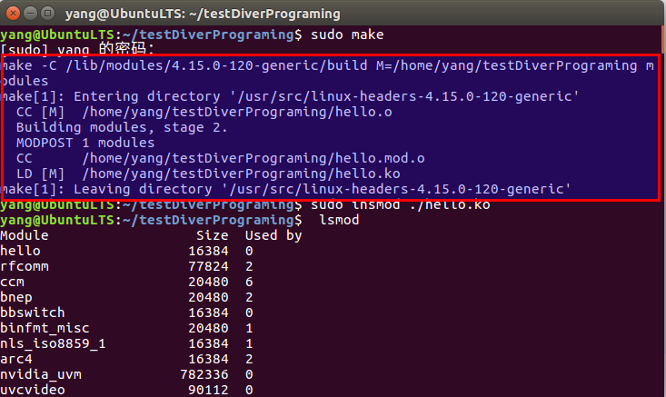
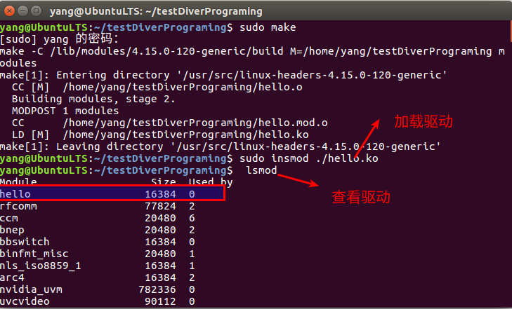
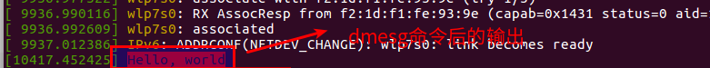
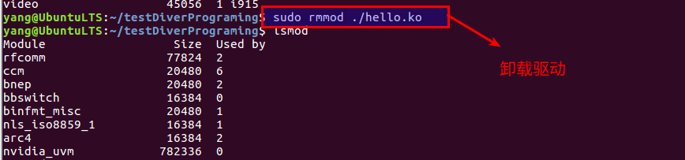

# Ubuntu配置驱动开发环境   

## 1 查询内核参数下载安装包    

```shell
# 查看系统内核版本
uname -r
4.15.0-39-generic
# 获取源文件包
sudo apt-get install linux-source-4.15.0
# 文件包默认在/usr/src中
cp /usr/src/linux-source-4.15.0.bz2  /home/yang/linux-source
# 解压至指定目录
cd /home/yang/linux-source
sudo tar -jxvf linux-source-4.15.0.bz2 
# 进入源码包目录
cd linux-source-4.15.0
```

## 2 安装驱动环境用的函数库   
```shell
# 配置内核
sudo make oldconfig  # 没有啥反应，看得没成功似的
# 编译内核
sudo make     # 此处报错：openssl/opensslv.h No such file or directory  
sudo apt-get install libssl-dev   # 解决 报错：openssl/opensslv.h No such file or directory     
sudo make   # 时间很长，大概一小时   
# 编译模块  
sudo make modules  
# 安装模块  
sudo make modules_install 
```

- 效果如下：   
    


## 3 编写用例   
- 新建一个目录，存放源码文件和Makefile文件    
- hello.c文件如下   
```shell
#include <linux/init.h>
#include <linux/module.h>
MODULE_LICENSE("Dual BSD/GPL");
static int hello_init(void)
{
    printk(KERN_ALERT "Hello, world\n");
    return 0;
}
static void hello_exit(void)
{
    printk(KERN_ALERT "Goodbye, cruel world\n");
}

module_init(hello_init);
module_exit(hello_exit);
```

- Makefile文件   
	- Makefile文件中的命令前面用的是tab    

```shell
obj-m :=hello.o
hellomodule-objs :=module #可以把hello这个改成你的命名
KERNELDIR := /lib/modules/$(shell uname -r)/build
PWD := $(shell pwd)
default:
    $(MAKE) -C $(KERNELDIR) M=$(PWD) modules
```

- 执行make命令   

```shell
sudo make 
```



## 4 运行示例   

```shell
# 加载驱动
sudo insmod hello.ko
# 终端输出
无输出
# 日志查看
dmesg      # Hello, world
# 查看加载的驱动
lsmod      # hello
# 卸载驱动
rmmod hello  
# 日志查看
dmesg    # Goodbye, cruel world
```
    

    

    


## 5 参考资料  

1. https://blog.csdn.net/Xin_101/article/details/84791761   
2. https://www.cnblogs.com/fogcell/p/6126316.html   

