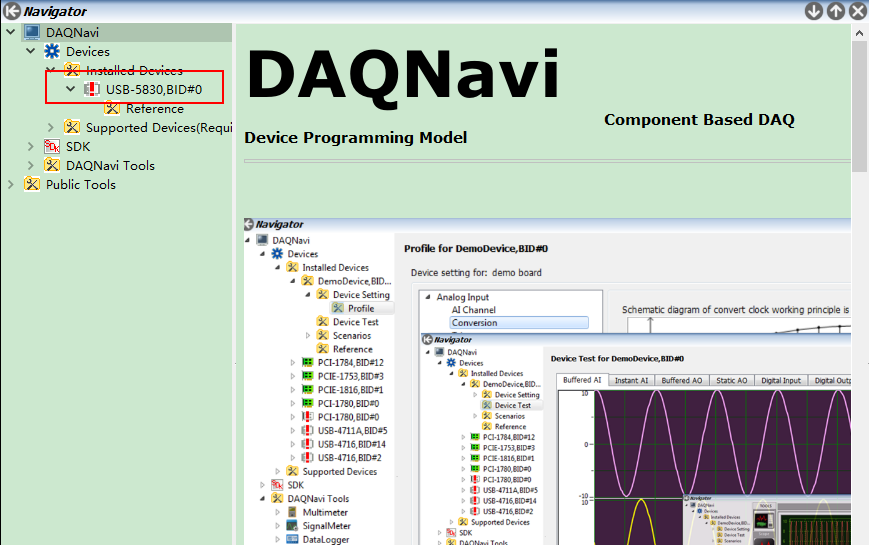
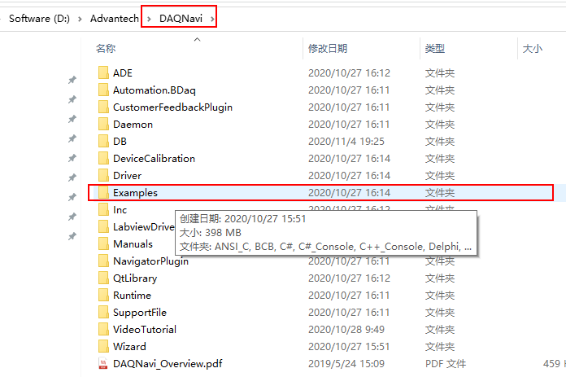
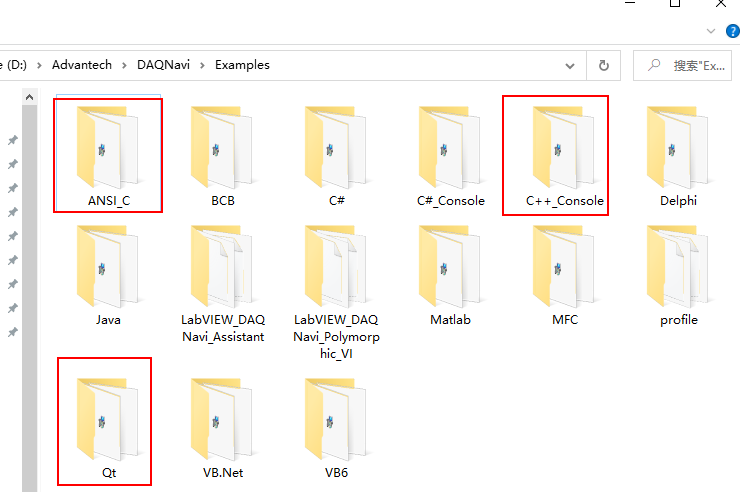

# USB-5830编程示例   
## 1 安装DAQ   
- DAQ是一个厂家自带的对自身硬件进行测试的软件    
- DAQ测试软件界面如下图所示：   

    

- 通过测试软件，可以知道IO模块的用法，以及相关的使用接口等一系列重要信息   

## 2 示例文件   
安装好DAQ之后，可以在安装目录下有个Examples目录，里面有各种语言的实现方式：
   
   

## 3 示例分析   
经过查看ANSI_C、C++\_Console和Qt的示例，发现如下：    

- USB-5830属于IO模块，主要关心里面两个例子：StaticDO和StaticDI   
- ANSI_C和C++\_Console里面实现IO控制代码量少，而且能实现完整功能，属于短小而又实用的程序，适合初步了解程序时进行解读   
- Qt里面有DI_StaticDI和DO_StaticDO两个例子，这两个例子正是DAQ测试软件的实现    


## 4 代码分析     

### 4.1 输入控制    
1. 创建InstantDiCtrl对象，相当于对应一个硬件设备的输入    
	- `InstantDiCtrl::Create()`创建函数   
2. 选择设备描述或者设备号     
	- `instantDiCtrl->setSelectedDevice(devInfo);`添加设备描述    
	- 设备描述`devInfo`需要改成自己现在的设备`L"USB-5830,BID#0" `    
3. 获取当前设备的状态   
	- `instantDiCtrl->getPorts()`这个本次不用     
4. 监听端口状态   
	- `instantDiCtrl->Read(startPort, portCount, bufferForReading);`监听多个端口    
	- `instantDiCtrl->ReadBit(startPort, bit, &data);`监听一个单独的端口    
5. 关闭设备，释放资源   
	- `instantDiCtrl->Dispose();`    

6. 错误信息返回    
	- `BioFailed(ret)`      

```C
// StaticDI.cpp   
#include <stdlib.h>
#include <stdio.h>
#include <math.h>
#include "../../../inc/bdaqctrl.h"
#include "../inc/compatibility.h"
using namespace Automation::BDaq;
typedef unsigned char byte;
#define  deviceDescription  L"USB-5830,BID#0"  
const wchar_t* profilePath = L"";
int32    startPort = 0;
int32    portCount = 1;

inline void waitAnyKey()
{
   do{SLEEP(1);} while(!kbhit());
} 

int main(int argc, char* argv[])
{
   ErrorCode        ret = Success;
   // Step 1: Create a 'InstantDiCtrl' for DI function.
   InstantDiCtrl * instantDiCtrl = InstantDiCtrl::Create();
   do
   {
      // Step 2: select a device by device number or device description and specify the access mode.
      // in this example we use ModeWrite mode so that we can fully control the device, including configuring, sampling, etc.
      DeviceInformation devInfo(deviceDescription);
      ret = instantDiCtrl->setSelectedDevice(devInfo);
      CHK_RESULT(ret);
      ret = instantDiCtrl->LoadProfile(profilePath);//Loads a profile to initialize the device.
      CHK_RESULT(ret);

      // Step 3: Read DI ports' status and show.
      //set port dircetion
      //Array<DioPort>* dioPort = instantDiCtrl->getPorts();
      //ret = dioPort->getItem(0).setDirectionMask(Input); //Set port0 direction
      //CHK_RESULT(ret);

      printf(" Reading ports' status is in progress, any key to quit !\n\n");
      byte  bufferForReading[64] = {0};//the first element of this array is used for start port
      //int8 data = 0;//data is used to the 'ReadBit'.
      //int  bit = 0;//bit is used to the 'ReadBit'.
      do
      {
         ret = instantDiCtrl->Read(startPort, portCount, bufferForReading);

		//ret = instantDiCtrl->ReadBit(startPort, bit, &data);
         //NOTE:
         //argument1:which port you want to contrl? For example, startPort is 0.
         //argument2:which bit you want to control? You can write 0--7, any number you want.
         //argument3:data is used to save the result.   
         /************************************************************************/
         CHK_RESULT(ret);  
         //Show ports' status
         for ( int32 i = startPort;i < startPort+portCount; ++i)
         {
            printf(" DI port %d status is: 0x%X\n\n", i, bufferForReading[i-startPort]);
            //printf(" DI port %d status is: 0x%X\n\n", i, data);// for 'ReadBit'
         }
         SLEEP(1);
      }while(!kbhit());
   }while(false);

	// Step 4: Close device and release any allocated resource.
	instantDiCtrl->Dispose();

	// If something wrong in this execution, print the error code on screen for tracking.
   if(BioFailed(ret))
   {
      wchar_t enumString[256];
      AdxEnumToString(L"ErrorCode", (int32)ret, 256, enumString);
      printf("Some error occurred. And the last error code is 0x%X. [%ls]\n", ret, enumString);
      waitAnyKey();
   }
   return 0;
}
```

### 4.2 输入控制    
1. 创建instantDoCtrl对象，相当于对应一个硬件设备的输出    
	- `InstantDoCtrl::Create()`    
2. 选择设备描述或者设备号     
	- `instantDoCtrl->setSelectedDevice(devInfo);`   
	- 设备描述`devInfo`需要改成自己现在的设备`L"USB-5830,BID#0" `  
	- `profilePath`改为`""`即可    
3. 读取输出端口状态   
	- `instantDoCtrl->getPorts()`    
4. 更新端口状态   
	- `instantDoCtrl->Write(startPort, portCount, bufferForWriting );`一次修改多个端口状态    
	- `instantDoCtrl->WriteBit(startPort, bit, data);`每次修改指定端口状态    
5. 关闭设备，释放资源    
	- `instantDoCtrl->Dispose();`    
6. 错误信息返回    
	- `BioFailed(ret)`     


```C++
#include <stdlib.h>
#include <stdio.h>
#include "../inc/compatibility.h"
#include "../../../inc/bdaqctrl.h"
using namespace Automation::BDaq;

typedef unsigned char byte;

#define  deviceDescription  L"USB-5830,BID#0"
const wchar_t* profilePath = L"";
int32    startPort = 0;
int32    portCount = 1;

inline void waitAnyKey()
{
   do{SLEEP(1);} while(!kbhit());
} 

int main(int argc, char* argv[])
{
   ErrorCode        ret = Success;
   // Step 1: Create a instantDoCtrl for DO function.
   InstantDoCtrl * instantDoCtrl = InstantDoCtrl::Create();
   do
   {
      // Step 2: Select a device by device number or device description and specify the access mode.
      // in this example we use ModeWrite mode so that we can fully control the device, including configuring, sampling, etc.
      DeviceInformation devInfo(deviceDescription);
      ret = instantDoCtrl->setSelectedDevice(devInfo);
      CHK_RESULT(ret);
      ret = instantDoCtrl->LoadProfile(profilePath);//Loads a profile to initialize the device.
      CHK_RESULT(ret);
      
      // Step 3: Write DO ports
      //Set port direction
      //Array<DioPort>* dioPort = instantDoCtrl->getPorts();
      //ret = dioPort->getItem(0).setDirectionMask(Output); //Setting port0 direction
      //CHK_RESULT(ret);
      byte  bufferForWriting[64] = {0};//the first element is used for start port
      //uint32 data = 0;//the data is used to the 'WriteBit';
      //int bit = 1;//the bit is used to the 'WriteBit';
      for (int32 i = startPort; i < portCount + startPort; ++i)
      {
         uint32 inputVal = 0;
         printf(" Input a 16 hex number for DO port %d to output(for example, 0x00): ", i);
         scanf("%x", &inputVal);
         bufferForWriting[i-startPort] = (byte)inputVal; 
      }
      for (int i = 0; i < 16; ++i)
          printf("%d ", bufferForWriting[i]);
      printf("\n");


      ret = instantDoCtrl->Write(startPort, portCount, bufferForWriting );
      ret = instantDoCtrl->WriteBit(startPort, 0x02, 1);
      ret = instantDoCtrl->WriteBit(startPort, 0x02, 0);
      ret = instantDoCtrl->WriteBit(startPort, 0x02, 1);
      ret = instantDoCtrl->WriteBit(startPort, 0x02, 0);
      ret = instantDoCtrl->WriteBit(startPort, 0x02, 1);
      ret = instantDoCtrl->WriteBit(startPort, 0x02, 0);

      /************************************************************************/
      /*printf(" Input value: ");
      //scanf("%d", &data);//for 'WriteBit'
      //ret = instantDoCtrl->WriteBit(startPort, bit, data);
      //NOTE:
		//This function is used to write digital data to the specified DO channel immediately
      //argument1:which port you want to contrl? For example, startPort is 0.
      //argument2:which bit you want to control? You can write 0--7, any number you want.
      //argument3:What status you want, open or close? 1 menas open, 0 means close.*/
      /************************************************************************/
      CHK_RESULT(ret);
      printf("\n DO output completed !");

      // Read back the DO status. 
      // Note: 
      // For relay output, the read back must be deferred until the relay is stable.
      // The delay time is decided by the HW SPEC.
      // BYTE bufferForReading[64] = {0};
      // ret = instantDoCtrl->Read( startPort,portCount,bufferForReading );
      // if(BioFailed(ret))
      // {
      //    break;
      // }
      // Show DO ports' status
      // for ( LONG i = startPort;i < portCount + startPort; ++i)
      //{
      //    printf("Now, DO port %d status is:  0x%X\n\n", i, bufferForReading[i-startPort]);
      //}
   }while(false);

	// Step 4: Close device and release any allocated resource.
	instantDoCtrl->Dispose();

	// If something wrong in this execution, print the error code on screen for tracking.
   if(BioFailed(ret))
   {
      wchar_t enumString[256];
      AdxEnumToString(L"ErrorCode", (int32)ret, 256, enumString);
      printf("Some error occurred. And the last error code is 0x%X. [%ls]\n", ret, enumString);
   }
   waitAnyKey();
   return 0;
}
```


